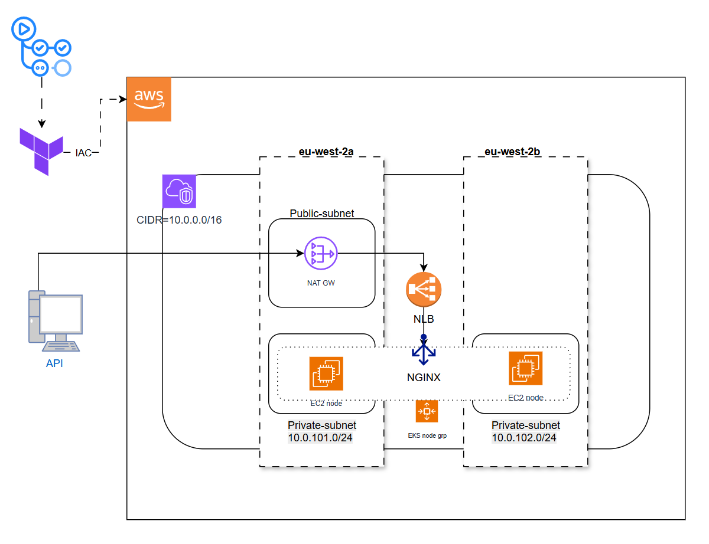
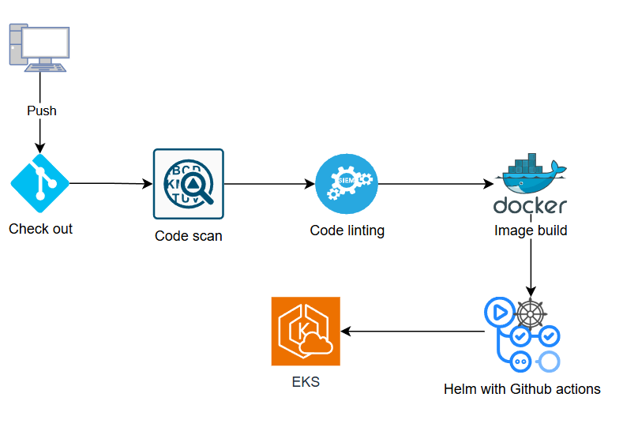

# HiveBox
HiveBox

**Overview**

HiveBox is a FastAPI-based application designed to monitor and aggregate the temperature readings from three specified sensors. It provides API endpoints to retrieve sensor temperatures, calculate the average, store the result in a Minio bucket, check sensor readiness, and report the application version. The app uses Redis for caching and is built for deployment on AWS EKS, leveraging Kubernetes manifests and a Dockerized workflow. CI/CD automation and security are integrated through GitHub Actions.

This repo is the implementation of the hands-on project HiveBox provided by [Dynamic DevOps](https://devopsroadmap.io/getting-started/).

The HiveBox project is divided into phases where each phase contains incremental steps to complete the full project and exist in the corresponding branch.

**Features**

- **/temperature**: Retrieve the average temperature from three sensors. Returns a qualitative assessment ("Too cold", "Good", "Too hot") based on the average.
- **/version**: Displays the current application version.
- **/store**: Triggers upload of the cached average temperature to a public Minio bucket.
- **/readyz**: Readiness probe endpoint, verifies sensor availability.
- **/metrics**: Exposes Prometheus metrics for monitoring.
- **Redis Caching**: Caches the average temperature for efficient repeated access.
- **Scheduled Minio Upload**: Automatically uploads cached averages to Minio every 5 minutes.

**Project Structure**

Code

main.py # Main FastAPI application, implements API endpoints and logic

Dockerfile # Multi-stage Docker build for lightweight and secure containerization

k8s/ # Kubernetes manifests for deploying the app, Redis, Prometheus, and ingress

.github/workflows/ # GitHub Actions for CI/CD automation and security

version.py # Contains the app’s version string

requirements.txt # Python dependencies for the app

.env # Environment variable definitions (not committed)

**API Endpoints**

- GET /temperature: Returns average temperature status from the three sensors.
- GET /version: Returns current software version.
- GET /store: Stores the cached average temperature in Minio bucket.
- GET /readyz: Checks readiness of the sensors.
- GET /metrics: Prometheus metrics endpoint (auto-exposed).

**Deployment**

**Docker**

Build and run the application container:

sh

docker build -t hivebox-app .

docker run --env-file .env -p 8000:8000 hivebox-app

**Kubernetes/EKS**

- Apply the manifests from the k8s/ folder to deploy the application, Redis, and Prometheus.
- The NGINX ingress controller publishes the endpoints.
- CI/CD automation is set via GitHub Actions for both application and infrastructure deployment.

**CI/CD & Security**

- **CI/CD Pipeline**: Automated build, test, and deployment via GitHub Actions.
- **Security Workflows**: Includes secret scanning, dependency review, and other best-practice security checks (see .github/workflows/ for details).

**Requirements**

- Python 3.9+
- Redis
- Minio (public bucket)
- Docker (for containerization)
- Kubernetes (for orchestration, tested on EKS)
- Prometheus (for monitoring)
- NGINX Ingress Controller

**Environment Variables**

The following environment variables should be configured (typically in .env):

- REDIS_URL
- BOXES (comma-separated sensor IDs)
- BOXES_URL (base API URL for sensors)
- MINIO_ACCESS_KEY
- MINIO_SECRET_KEY

